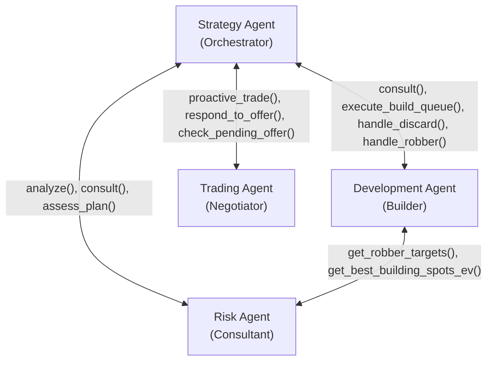
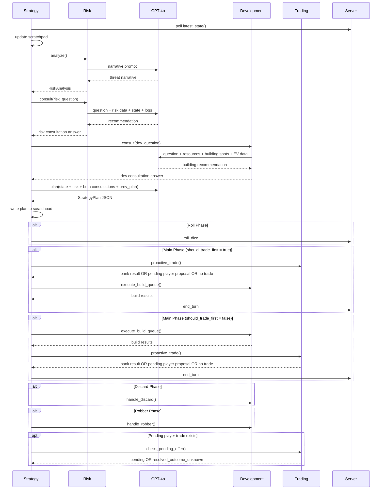
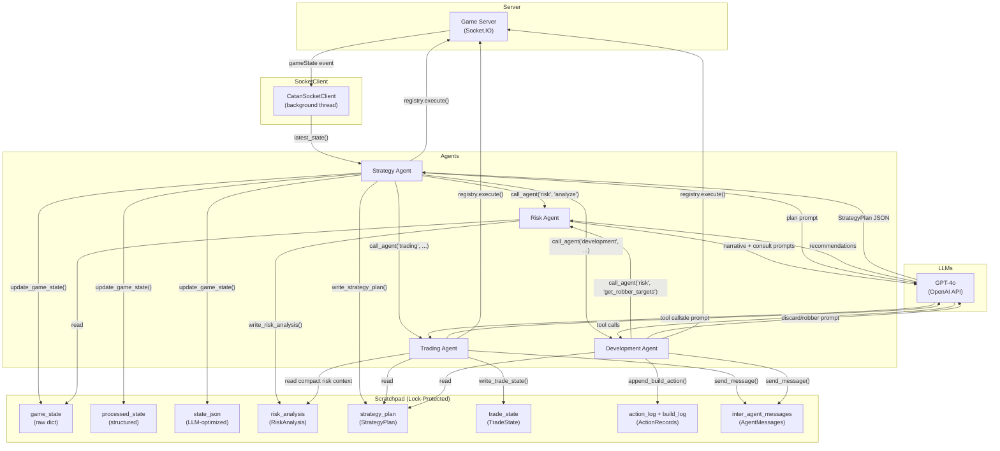

# Multi-Agent Architecture for Settlers of Catan

> Technical reference for a four-agent cooperative system that plays Settlers of Catan on [Colonist.io](https://colonist.io) via a custom game server.

---

## Table of Contents

1. [Architecture Overview](#1-architecture-overview)
2. [System Topology](#2-system-topology)
3. [Shared Infrastructure](#3-shared-infrastructure)
   - 3.1 [Scratchpad (Shared Memory)](#31-scratchpad-shared-memory)
   - 3.2 [BaseAgent (Abstract Contract)](#32-baseagent-abstract-contract)
   - 3.3 [Tool Registry](#33-tool-registry)
4. [Agent Specifications](#4-agent-specifications)
   - 4.1 [Strategy Agent](#41-strategy-agent)
   - 4.2 [Risk Agent](#42-risk-agent)
   - 4.3 [Development Agent](#43-development-agent)
   - 4.4 [Trading Agent](#44-trading-agent)
5. [Data Flow & Turn Lifecycle](#5-data-flow--turn-lifecycle)
6. [LLM Integration](#6-llm-integration)
7. [Game State Representation](#7-game-state-representation)
8. [Probability Model](#8-probability-model)
9. [Statistics & Observability](#9-statistics--observability)
10. [File Structure](#10-file-structure)

---

## 1. Architecture Overview

The system implements a **decentralized cooperative multi-agent architecture** for playing Settlers of Catan. Four specialized agents collaborate through a shared memory substrate (the *Scratchpad*) and a strict peer-to-peer communication topology enforced at the code level.

### Design Principles

| Principle | Implementation |
|---|---|
| **Separation of concerns** | Each agent owns exactly one cognitive domain: strategic planning, risk/probability, building/execution, or trading. |
| **Hierarchical coordination** | The Strategy Agent acts as the orchestrator ("brain"), while the other three are specialized executors. |
| **Hybrid reasoning** | Deterministic math (probabilities, heuristics) is preferred where possible; LLMs are used for plan generation, risk consultation, and ambiguous decisions. |
| **Graceful degradation** | Every LLM call has a deterministic fallback. If GPT-4o is unreachable, heuristics execute. |
| **Thread safety** | All shared state is guarded by `threading.Lock`. The socket client runs on a background thread; agents run on the main thread in a synchronous turn loop. |

### LLM Hierarchy

All four agents use **GPT-4o** as their primary LLM. Ollama (qwen3:8b) is available only for the legacy single-agent mode.

| Agent | Primary LLM | Fallback |
|---|---|---|
| Strategy | GPT-4o (plan generation) | Retain previous plan |
| Risk | GPT-4o (consultation, narratives, plan assessment) | Deterministic templates |
| Development | GPT-4o (consultation, discard/robber decisions) | Deterministic heuristics |
| Trading | GPT-4o (trade evaluation, proactive proposals) | Policy-based scoring heuristics |

---

## 2. System Topology

### Communication Graph



### Allowed Channels (Code-Enforced)

The communication topology is enforced by the `ALLOWED_CHANNELS` constant in `BaseAgent`. Any `call_agent()` or `send_message()` to an unauthorized peer raises a `PermissionError` at runtime.

| Agent | Can Communicate With |
|---|---|
| Strategy | Development, Trading, Risk |
| Development | Strategy, Risk |
| Risk | Strategy, Development |
| Trading | Strategy **only** |

Key constraint: **Trading cannot talk to Risk or Development.** This is a deliberate architectural decision — all strategic intent for trading decisions flows through Strategy's `TradePolicy`. Trading may still read shared scratchpad context, including compact cached `RiskAnalysis`, but it cannot independently consult Risk or Development.

### Communication Mechanisms

The system provides two parallel communication channels:

1. **Direct method invocation** (`call_agent(peer, method, **kwargs)`): Synchronous, typed, used for primary control flow (e.g., Strategy calling `risk.analyze()`).
2. **Asynchronous scratchpad messaging** (`send_message(to, type, content)`): Fire-and-forget, used for informational updates (e.g., Development informing Strategy of build results).

---

## 3. Shared Infrastructure

### 3.1 Scratchpad (Shared Memory)

The `Scratchpad` class (`Agent/shared/scratchpad.py`) is the central in-memory state store. All inter-agent data flow (beyond direct method calls) passes through this object. It is protected by a single `threading.Lock` to prevent data races between the socket listener thread and the agent main thread.

#### Data Regions

| Region | Writer | Reader(s) | Description |
|---|---|---|---|
| `game_state` | Strategy | All | Raw dict from `getPlayerView` socket event |
| `processed_state` | Strategy | All | Structured extraction via `GameStateProcessor` |
| `state_json` | Strategy | All | Token-efficient JSON for LLM prompts |
| `risk_analysis` | Risk | Strategy, Development, Trading | `RiskAnalysis` dataclass (income, threats, robber targets, etc.). Trading receives a compact threat/win-probability summary for trade safety. |
| `strategy_plan` | Strategy | Development, Trading | `StrategyPlan` dataclass (goals, build queue, trade policy) |
| `trade_state` | Trading | Strategy | `TradeState` dataclass (reputation, pending offers, history) |
| `build_log` | Development | Strategy | Per-turn build action records |
| `action_log` | All | All | Append-only log of all `ActionRecord`s |
| `inter_agent_messages` | All | Addressed agent | Append-only `AgentMessage` queue |

#### Schema Definitions (Dataclasses)

**`RiskAnalysis`** — Output of the Risk Agent's deterministic + LLM analysis.
```
resource_expected_income : Dict[str, float]     # per-resource income/turn
per_building_income      : List[Dict]           # per-building breakdown
opponent_threats         : List[Dict]           # ranked threat assessments
win_probabilities        : Dict[str, float]     # estimated win probability per player
robber_impact            : List[Dict]           # hexes ranked by robber net impact
best_settlement_vertices : List[Dict]           # vertices ranked by settlement EV
best_city_vertices       : List[Dict]           # settlements ranked by city upgrade gain
threat_narrative         : str                  # 2-3 sentence LLM-generated summary
updated_at               : float                # timestamp
```

**`StrategyPlan`** — Strategy Agent's turn plan, consumed by Development and Trading.
```
long_term_goal      : str          # "cities" | "longest_road" | "largest_army" | "balanced"
short_term_goals    : List[str]    # 1-3 immediate objectives
priority_resources  : List[str]    # ordered resource priority
build_queue         : List[Dict]   # ordered build actions for Development
trade_policy        : TradePolicy  # guidance for Trading Agent
should_trade_first  : bool         # dynamic action ordering: trade before build?
risk_tolerance      : str          # "aggressive" | "moderate" | "conservative"
reasoning           : str          # 2-3 sentences of strategic reasoning
```

**`TradePolicy`** — Strategy's guidance for the Trading Agent.
```
willing_to_give             : List[str]  # resources we can trade away
desperately_need            : List[str]  # resources we must acquire
max_bank_ratio_acceptable   : int        # highest bank ratio we'll accept (default: 4)
should_propose_trades       : bool       # whether Trading is allowed to initiate trades
min_accept_score            : float      # minimum heuristic score to accept incoming offers
```

**`TradeState`** — Trading Agent's persistent state across turns.
```
recent_trades          : List[Dict]           # last 20 trade outcomes
pending_offer          : Optional[Dict]       # current outgoing offer with kind/status metadata
player_trade_history   : Dict[str, List]      # per-opponent trade log
player_reputation      : Dict[str, float]     # per-opponent reputation [-1.0, 1.0]
```

**`ActionRecord`** — Single action taken by any agent.
```
agent     : str   # "strategy" | "development" | "trading" | "risk"
action    : str   # tool name or method name
args      : Dict  # action arguments
result    : Dict  # server response
success   : bool  # whether the action succeeded
timestamp : float # when the action occurred
```

**`AgentMessage`** — Inter-agent message stored on the scratchpad.
```
from_agent    : str   # sender agent name
to_agent      : str   # recipient agent name
message_type  : str   # "request" | "inform" | "query"
content       : Dict  # arbitrary payload
timestamp     : float # when the message was sent
```

### 3.2 BaseAgent (Abstract Contract)

Every agent inherits from `BaseAgent` (`Agent/shared/base_agent.py`), which provides:

1. **Peer registration**: `register_peer(agent)` accepts peers only if they are in the agent's `ALLOWED_CHANNELS`.
2. **Direct invocation**: `call_agent(peer_name, method, **kwargs)` validates the topology at runtime, then calls the method on the peer.
3. **Scratchpad messaging**: `send_message(to, msg_type, content)` writes an `AgentMessage` to the shared scratchpad (also topology-checked).
4. **Message reading**: `get_messages()` retrieves all messages addressed to this agent.

### 3.3 Tool Registry

The `ToolRegistry` (`Agent/tools/registry.py`) provides a unified interface for all game actions and queries. Tools are registered with:

- **OpenAI JSON Schema**: For GPT-4o function-calling (structured output).
- **Phase filtering**: Each tool specifies which turn phases it is available in (`roll`, `main`, `discard`, `robber`, `setup`, `specialBuild`).
- **Agent filtering**: Each tool specifies which agents can access it (e.g., `move_robber` is only available to `development`).
- **Handler function**: The actual Python callable that executes the action via the socket client.

#### Registered Tools (22 total)

| Tool | Phases | Agents | Description |
|---|---|---|---|
| `roll_dice` | roll | strategy, development | Roll the dice |
| `end_turn` | main | strategy | End the current turn |
| `place_settlement` | main, setup | development | Place a settlement on a vertex |
| `place_road` | main, setup | development | Place a road on an edge |
| `upgrade_to_city` | main | development | Upgrade a settlement to a city |
| `buy_dev_card` | main | development | Buy a development card |
| `play_dev_card` | main | development | Play a development card |
| `discard_cards` | discard | development | Discard resources on a 7 |
| `move_robber` | robber | development | Move the robber and optionally steal |
| `bank_trade` | main | trading | Execute a bank/port trade |
| `propose_trade` | main | trading | Propose a player-to-player trade |
| `respond_to_trade` | main | trading | Accept or decline a trade offer |
| `counter_trade` | main | trading | Counter an existing trade offer |
| `cancel_trade` | main | trading | Cancel your own pending trade |
| `get_trade_options` | main | strategy, trading | List available bank trade ratios |
| `get_trade_offer_status` | main | trading | Check status of your pending offer |
| `get_building_spots` | main, setup | strategy, development | Get candidate vertices/edges for building |
| `get_expected_income` | all | strategy, development | Expected resources/turn from buildings |
| `get_opponent_threats` | all | strategy, development | Ranked opponent threat assessment |
| `get_robber_targets` | robber, main | strategy, development | Hexes ranked by robber impact |
| `get_best_building_spots_ev` | main, setup | strategy, development | Probability-weighted building spot ranking |
| `get_win_probabilities` | all | strategy | Estimated win probability per player |

---

## 4. Agent Specifications

### 4.1 Strategy Agent

**Role**: Orchestrator and "brain" of the system.  
**LLM**: GPT-4o for plan generation.  
**File**: `Agent/strategy_agent/agent.py`  
**Peers**: Development, Trading, Risk.

#### Responsibilities

1. **Owns the game loop**: Connects to the server, joins/creates the game, and polls for state updates in a `while True` loop with 150–250ms ticks.
2. **State management**: Ingests the raw `getPlayerView` state from the socket and writes it to the Scratchpad (`update_game_state`), triggering the `GameStateProcessor`.
3. **Risk invocation**: Calls `risk.analyze()` at the start of every turn, which populates the Scratchpad's `RiskAnalysis` region with fresh mathematical data.
4. **Dual consultation**: Before planning, Strategy consults two agents:
   - `risk.consult(question)` — competitive intelligence (threats, blocking, resource scarcity).
   - `development.consult(question)` — building advice (best spots, upgrade vs. expand, ROI).
   Both answers flow into the GPT-4o planning context.
5. **Plan generation**: Constructs a prompt containing the structured game state, risk analysis, **both consultations**, previous plan, inter-agent messages, and available building spots, then sends it to GPT-4o. The response is parsed into a `StrategyPlan` dataclass.
6. **Phase-aware delegation with dynamic ordering**:
   - **Roll phase**: Executes `roll_dice` directly (trivial, no LLM needed).
   - **Discard phase**: Delegates to `development.handle_discard()`.
   - **Robber phase**: Delegates to `development.handle_robber()`.
   - **Main phase**: The plan's `should_trade_first` flag determines whether trading or building happens first. `delegate_trade()` is non-blocking: Trading either completes a bank trade, posts a pending player proposal, or reports no viable trade, then returns control to Strategy. Strategy remains responsible for calling `end_turn`.
7. **Trade follow-up ownership**: Strategy polls pending player offers via `trading.check_pending_offer()` on later ticks. If an incoming offer or counter appears, Strategy wakes the Trading agent via `trading.respond_to_offer()`.
8. **Off-turn monitoring**: Even when it's not our turn, Strategy monitors for incoming trade offers and wakes the Trading agent via `trading.respond_to_offer()`.
9. **Setup phase**: Handled entirely by heuristics (no LLM) — iterates over ranked settlement vertices and road edges, brute-forcing placements until the server accepts one.

#### GPT-4o System Prompt (Condensed)

> You are the Strategy Agent for a Settlers of Catan AI. You are the brain of a multi-agent system. You receive: (1) current game state, (2) risk analysis, (3) a Risk consultation (competitive analysis), (4) a Development consultation (building advice), (5) previous strategy plan, (6) messages from other agents. Your job is to produce a STRATEGY PLAN as a JSON object with fields: long_term_goal, short_term_goals, priority_resources, build_queue, trade_policy, should_trade_first, risk_tolerance, reasoning.

Key rules enforced in the prompt:
- Reassess `long_term_goal` every turn — avoid stubbornly losing strategies.
- If an opponent is at 8+ VP, shift to aggressive (block them).
- Use the Risk consultation to understand competitive threats.
- Use the Development consultation to inform the build queue.
- Build queue must use exact vertex/edge keys.
- Trade policy expresses resource intent only: what resources Trading may give, what resources we need, the maximum acceptable bank ratio, whether proactive trading is allowed, and the minimum accept score. Trading owns the bank-vs-player decision.
- Set `should_trade_first` to true if resources are needed before building, false if building can proceed immediately.

#### Turn Sequence Diagram



---

### 4.2 Risk Agent

**Role**: Interactive risk consultant.  
**LLM**: GPT-4o for consultation, narrative generation, and plan assessment.  
**Files**: `Agent/risk_agent/agent.py` (240 lines), `Agent/risk_agent/prompts.py` (138 lines), `Agent/risk_agent/probabilities.py` (383 lines)  
**Peers**: Strategy, Development.

#### Architecture: Consultant Model (Math + GPT-4o)

The Risk Agent is designed as an **interactive consultant** that Strategy can query with specific questions. It combines a deterministic math backend (`probabilities.py`) with GPT-4o reasoning. All context is read from the shared Scratchpad — the Risk Agent has no private state beyond its OpenAI client.

The agent operates in three modes:

1. **Analyze** (`analyze()`): Runs all deterministic math functions, generates a GPT-4o threat narrative, writes `RiskAnalysis` to the scratchpad. Called by Strategy at the start of every turn.
2. **Consult** (`consult(question)`): Strategy asks a specific risk question. Risk builds a rich context from the scratchpad (risk analysis, game state, action log) and has GPT-4o answer with a concrete, actionable recommendation.
3. **Assess Plan** (`assess_plan(plan)`): Strategy passes a draft plan for Risk to critique against the current risk data. GPT-4o reviews and flags concerns.

#### GPT-4o System Prompts

**Consultant prompt** (for `consult()`):
> You are the Risk Consultant for a Settlers of Catan AI multi-agent system. Answer risk questions from the Strategy Agent using the mathematical analysis, board state, and action history provided. Be specific (player names, VP counts, hex coordinates). Be concise (3-5 sentences). Always recommend a concrete action.

**Plan assessment prompt** (for `assess_plan()`):
> The Strategy Agent has drafted a plan. Review it against the risk data and flag: Does the build queue make sense? Is the trade policy safe? Are we ignoring a critical threat? Is the long-term goal still viable?

**Narrative prompt** (for `analyze()`):
> Write a concise 2-3 sentence threat summary. Focus on: who is closest to winning, which resources are critical, and one suggested tactical priority.

All three have deterministic fallbacks when GPT-4o is unavailable.

#### Strategy → Risk Consultation Flow

Strategy derives a turn-relevant question based on the current game state:

| Game Condition | Example Question |
|---|---|
| Opponent at 8+ VP | "Alice is at 9 VP and close to winning. How should I block them?" |
| Critical resource scarcity | "My ore income is 0.028/turn. Should I build toward a new source, trade, or shift strategy?" |
| Mid/late game (6+ VP) | "I'm at 7 VP. What's the fastest path to 10 VP given current threats?" |
| General (turn > 2) | "What should my top strategic priority be this turn?" |
| Early game (turn ≤ 2) | *(no consultation — too early)* |

The consultation answer replaces the threat narrative in the scratchpad, so it flows directly into Strategy's GPT-4o planning context.

#### Deterministic Functions (`probabilities.py`)

| Function | Input | Output | Algorithm |
|---|---|---|---|
| `expected_resource_income(state)` | Game state | `Dict[str, float]` per-resource | For each of our buildings, sum `(pips/36) * multiplier` for each adjacent non-desert, non-robber hex. City multiplier = 2.0, settlement = 1.0. |
| `per_building_income(state)` | Game state | `List[Dict]` per-building breakdown | Same calculation as above, but returns individual rows with vertex, building type, resource, number token, pips, expected/turn, and robber-blocked flag. |
| `opponent_threat_assessment(state)` | Game state | `List[Dict]` ranked by threat_score | Composite score: `VP*10 + income*8 + dev_cards*3 + total_cards*0.5 + road_proximity_bonus + army_proximity_bonus + achievement_bonus`. Classified as critical (≥8 VP or ≥75 score), high, medium, or low. |
| `robber_impact_analysis(state)` | Game state | `List[Dict]` ranked by net_impact | For each non-desert hex: calculate total opponent production loss minus our own production loss. Production loss = `(pips/36) * building_multiplier` for each building touching the hex. |
| `rank_vertices_by_expected_value(state)` | Game state | `List[Dict]` top-k vertices | For legal (unoccupied, distance-rule-safe) vertices: `EV = Σ(pips/36 * resource_weight)` where resource weights are dynamic based on hand scarcity (0 cards = weight 2.0, 1 card = 1.5, 2-3 cards = 1.0, 4+ cards = 0.6). Includes diversity bonus. |
| `rank_cities_by_value_gain(state)` | Game state | `List[Dict]` our settlements ranked | Gain from upgrading settlement to city = current expected income (since city doubles production from 1x to 2x). |
| `win_probability_estimate(state)` | Game state | `Dict[str, float]` per-player | Weighted heuristic: VP progress (50%), income rate (20%), dev cards (15%), achievement proximity (15%). Normalized to sum 1.0. |

#### Threat Level Classification

| Level | Condition |
|---|---|
| Critical | VP ≥ 8 **or** composite threat score ≥ 75 |
| High | VP ≥ 6 **or** composite threat score ≥ 50 |
| Medium | VP ≥ 4 **or** composite threat score ≥ 30 |
| Low | All else |

#### Methods Exposed to Peers

| Method | Called By | Returns |
|---|---|---|
| `analyze()` | Strategy (every turn) | `RiskAnalysis` dataclass (math + GPT-4o narrative, written to scratchpad) |
| `consult(question)` | Strategy (every turn, after analyze) | `str` — GPT-4o recommendation (3-5 sentences) |
| `assess_plan(plan)` | Strategy (optional, before committing plan) | `str` — GPT-4o critique with up to 3 concerns |
| `get_robber_targets()` | Development (during robber phase) | `List[Dict]` — hexes ranked by net damage to opponents |
| `get_best_building_spots_ev(building_type)` | Development (during builds) | `List[Dict]` — vertices or settlements ranked by EV |
| `get_opponent_threat_summary()` | Strategy (quick threat check) | `List[Dict]` — cached or recomputed opponent threats |

---

### 4.3 Development Agent

**Role**: Building consultant and build queue executor; handles discard and robber phases.  
**LLM**: GPT-4o for consultation, discard/robber decisions (optional, with deterministic fallback).  
**Files**: `Agent/development_agent/agent.py`, `Agent/development_agent/prompts.py`  
**Peers**: Strategy, Risk.

#### Architecture: Consultant + Executor Model

The Development Agent operates in two modes:

1. **Consultant** (`consult(question)`): Strategy asks a building question before planning. Development builds context from the scratchpad (game state, resources, building spots, Risk's EV data) and has GPT-4o answer with a concrete recommendation. Deterministic fallback when GPT-4o is unavailable.
2. **Executor** (`execute_build_queue()`): After planning, Strategy delegates the build queue. Development executes registry tools in order, skipping failures.

#### GPT-4o Consultation Prompt

**Consultant prompt** (for `consult()`):
> You are the Development Consultant for a Settlers of Catan AI multi-agent system. Answer building and development questions from the Strategy Agent using the game state, resources, building costs, available spots, and risk data provided. Be specific (vertex keys, costs, income gains). Be concise (3-5 sentences). Always recommend a concrete action.

#### Strategy → Development Consultation Flow

Strategy derives a turn-relevant building question based on resources and income:

| Game Condition | Example Question |
|---|---|
| Can afford both city and settlement | "I can afford both. Which gives better ROI — income gain vs. VP gain?" |
| Can afford city only | "Which settlement should I upgrade for the best income boost?" |
| Can afford settlement only | "Where should I place it for the best resource income?" |
| Unbalanced income | "My ore income is only 0.028/turn. What's the best building move to diversify?" |
| General (turn > 2) | "What's my best building move this turn given my resources?" |
| Early game (turn ≤ 2) | *(no consultation — too early)* |

#### Build Queue Execution (`execute_build_queue`)

Strategy's `StrategyPlan.build_queue` is an ordered list of actions like:
```json
[
  {"action": "place_settlement", "target": "v_0_-1_2", "priority": 1},
  {"action": "upgrade_to_city", "target": "v_1_0_5", "priority": 2},
  {"action": "buy_dev_card", "target": null, "priority": 3}
]
```

Development iterates through this list in priority order, mapping each entry to a registry tool via an alias system (e.g., `"placeSettlement"` → `"place_settlement"`, `"buyDevCard"` → `"buy_dev_card"`). If a tool call fails (insufficient resources, illegal placement), it **skips and continues** — the server is the authority on legality. Results are reported back to Strategy via both `send_message` and `call_agent`.

#### Discard Handling (`handle_discard`)

When a 7 is rolled and a player has more than 7 cards, the server requires discarding. Development handles this in two tiers:

1. **LLM path** (preferred when OpenAI is available): Constructs a prompt with Strategy's `priority_resources`, the game state, and the discard requirement. GPT-4o selects which resources to discard via the `discard_cards` tool. If the LLM fails to produce a valid tool call within 2 rounds of repair, falls through.
2. **Deterministic path**: Orders resources with non-priority resources first, then discards greedily from the most abundant non-priority resource down.

#### Robber Handling (`handle_robber`)

When a 7 is rolled or a Knight card is played, the robber must be moved. Development handles this in three tiers:

1. **Risk-informed**: Calls `risk.get_robber_targets()` to get hexes ranked by net damage to opponents. Picks the top-scoring hex.
2. **LLM refinement**: If OpenAI is available, sends the risk targets and a heuristic suggestion to GPT-4o, which may override or confirm the choice.
3. **Heuristic fallback**: Scans all hexes, counting opponent buildings adjacent to each, and picks the hex that maximizes opponent disruption (ignoring our own buildings).

Steal target selection: For any chosen hex, scans vertices touching that hex for opponent buildings and selects the first opponent player found.

---

### 4.4 Trading Agent

**Role**: Proactive and reactive trade execution.  
**LLM**: GPT-4o for trade evaluation and proposal.  
**File**: `Agent/trading_agent/agent.py`  
**Peers**: Strategy **only**.

#### Trading Rules and Contract

Strategy does not decide whether to use the bank or another player. Strategy only provides a `TradePolicy` containing resource intent (`willing_to_give`, `desperately_need`), a maximum acceptable bank ratio, whether proactive trading is allowed, and the minimum score for incoming offers. Trading then autonomously chooses one of three outcomes per proactive invocation: execute a bank/port trade, post a player proposal, or decline to trade.

Bank ratios are dynamic. The default bank trade is 4:1, a generic port enables 3:1, and a specific-resource port enables 2:1 for that resource. The current server state (`tradeRatios`) and `get_trade_options` tool are the authority for what bank/port trades are legal.

Player trade semantics differ by direction:
- Outgoing `propose_trade`: `offer` is what we give, `request` is what we want.
- Incoming offer state: `offer` is what the proposer gives us, `request` is what they want from us.
- Counter offers use our outgoing semantics: `offer` is what we give, `request` is what we want.

#### Trade Modes

The Trading Agent operates in two distinct modes:

**Proactive Mode** (our turn, main phase):
1. Queries Strategy for the current `TradePolicy` via `call_agent("strategy", "get_trade_policy")`.
2. If `should_propose_trades` is false, exits immediately.
3. Builds an LLM prompt from Strategy policy, plan hints, current state, trade memory, and compact Risk context (`top_opponent_threats`, `win_probabilities`, `threat_narrative`).
4. Attempts a ReAct-style LLM loop (up to 6 steps) where GPT-4o chooses among proactive tools: `bank_trade`, `propose_trade`, `get_trade_options`, `get_game_summary`, `cancel_trade`, `get_trade_offer_status`.
5. Makes at most one proactive trade decision per invocation: one bank trade, one player proposal, or no trade. It does not chain bank and player trades in the same pass.
6. Bank trades complete synchronously. Player proposals are recorded in `trade_state.pending_offer` with `status="pending_player_response"` and return control to Strategy immediately.
7. Otherwise, falls through to deterministic heuristics: first attempts a bank trade for a desperately-needed resource at an acceptable ratio, then proposes a 1-for-1 player trade if possible.

**Reactive Mode** (off-turn, incoming offer):
1. Detects incoming trade offers via `extract_incoming_offer_for_me(state)`, which checks for targeted, broadcast, and `canRespond` flags.
2. Deduplicates offers using a signature hash to avoid responding to the same offer twice during polling.
3. Builds an LLM prompt from the current state, trade policy, trade memory, compact Risk context, and normalized incoming offer.
4. Attempts LLM evaluation first (up to 2 rounds): GPT-4o decides whether to accept, decline, or counter using `respond_to_trade` or `counter_trade` tools only.
5. Falls through to deterministic scoring: `_score_trade()` returns a value in [0, 1] based on whether the offer gives us desperately-needed resources and only takes resources we're willing to give. Opponent VP ≥ 8 applies a -0.35 penalty.
6. Accepted and declined offers are recorded immediately. Successful counters become pending offers and return control to Strategy.

**Pending Offer Follow-Up**:
1. Strategy calls `trading.check_pending_offer()` when `trade_state.pending_offer` exists.
2. Trading queries `get_trade_offer_status` once and returns immediately.
3. If our outgoing offer is still active, the status remains `pending_player_response`.
4. If the outgoing offer has disappeared, Trading clears `pending_offer` and reports `resolved_outcome_unknown`. The current server status exposes whether the offer still exists, but not whether it was accepted or declined.

#### Trade Scoring Heuristic

The deterministic `_score_trade()` function:
```
score = 0.5  (base)
For each resource in the offer (what we GET):
  +0.25 if desperately needed
  +0.05 if willingly traded
  -0.10 otherwise
For each resource in the request (what we GIVE):
  -0.20 if desperately needed
  -0.05 if willingly traded
  -0.12 otherwise
Clamped to [0.0, 1.0]
```

#### Counter-Offer Logic

When the score falls in the "near-threshold" window (`min_accept_score - 0.2` to `min_accept_score`), Trading attempts to build a counter-offer:
- Keeps the same structure but asks for +1 of a needed resource.
- If we'd give away a desperately-needed resource, tries to reduce that by 1.

#### Reputation System

The Trading Agent maintains per-opponent reputation scores in [-1.0, 1.0]:
- +0.05 per accepted trade
- -0.03 per declined trade

Reputation influences target selection: when proposing trades, the agent prefers opponents with lower VP (less threat) and higher reputation (more likely to accept). Opponents at ≥ 8 VP are blocked from receiving trade proposals.

#### Offer Lifecycle Management

After proposing a trade or counter-offer (either via LLM or heuristic), Trading does **not** block. It writes `trade_state.pending_offer`, reports `status="pending_player_response"`, and returns control to Strategy. Strategy owns follow-up checks by calling `check_pending_offer()` on later polling ticks.

---

## 5. Data Flow & Turn Lifecycle

### Complete Turn Data Flow



### Turn Phase Sequence

| Step | Actor | Action | Scratchpad Write |
|---|---|---|---|
| 1. Poll | Strategy | `client.latest_state()` | — |
| 2. Observe | Strategy | `scratchpad.update_game_state(state, processor)` | `game_state`, `processed_state`, `state_json` |
| 3. Analyze | Risk | `analyze()` → math + GPT-4o narrative | `risk_analysis` |
| 3b. Consult Risk | Risk | `consult(risk_question)` → GPT-4o recommendation | `risk_analysis.threat_narrative` |
| 3c. Consult Dev | Development | `consult(dev_question)` → GPT-4o building advice | — |
| 4. Plan | Strategy | GPT-4o (informed by both consultations) → `StrategyPlan` | `strategy_plan` |
| 5. Roll | Strategy | `registry.execute("roll_dice")` | `action_log` |
| 6–7. Trade/Build | Trading, Dev | Order determined by `should_trade_first` flag in the plan. Trading returns after one bank trade, one pending player proposal, or no trade. | `trade_state`, `build_log`, `action_log` |
| 8. End | Strategy | `registry.execute("end_turn")` | `action_log` |

### Off-Turn Behavior

Even when it is not our turn, the Strategy Agent continuously polls at 250ms intervals and:
1. Checks any existing `trade_state.pending_offer` via `trading.check_pending_offer()`.
2. Checks for incoming trade offers.
3. If an offer is detected, updates the Scratchpad and calls `trading.respond_to_offer()`.
4. The Trading Agent evaluates the offer (LLM or heuristic) and responds or posts a pending counter.

---

## 6. LLM Integration

### OpenAI Client (`Agent/utils/openai_client.py`)

A thin wrapper around the OpenAI Python SDK providing:
- `chat_with_tools(messages, tools, temperature, max_retries)`: Sends chat completions with native function-calling. Retries with exponential backoff (up to 90s) on HTTP 429 rate limits.
- `extract_tool_calls(response)`: Parses structured `{id, name, arguments}` dicts from the SDK response.
- `extract_text(response)`: Returns plain-text content.
- `extract_usage(response)`: Returns `{prompt_tokens, completion_tokens, total_tokens}`.
- `build_tool_result_message(tool_call_id, result)`: Creates the `"tool"` role message to feed results back to GPT-4o for multi-step reasoning.

Default parameters: `model="gpt-4o"`, `temperature=0.3`, `max_tokens=2048`.

### Ollama Client (`Agent/utils/ollama_client.py`)

A minimal, dependency-free HTTP wrapper for the Ollama `/api/chat` endpoint:
- `chat(messages, json_only)`: Non-streaming completion. When `json_only=True`, adds `"format": "json"` to encourage valid JSON output.
- `chat_with_usage(messages, json_only)`: Returns `(text, {prompt_tokens, completion_tokens})` using Ollama's `prompt_eval_count` and `eval_count` fields.
- `safe_json_loads(s)`: Robust JSON parser that attempts substring extraction on failure.

Default parameters: `model="llama3.1:8b"` (overridden to `qwen3:8b` at startup), `temperature=0.2`, `num_ctx=4096`, `timeout_s=60`.

### Tool-Calling Pattern (ReAct Loop)

Both Development and Trading agents use a multi-step ReAct-style loop when interacting with GPT-4o:

1. **Initial prompt**: System prompt + user context with available tools.
2. **GPT-4o response**: May contain text (reasoning) and/or tool calls.
3. **Tool execution**: Each tool call is executed via `registry.execute()`.
4. **Result feedback**: Tool results are appended as `"tool"` role messages.
5. **Repair loop**: If the tool call fails or GPT-4o doesn't produce a tool call, a corrective user message is appended and the loop continues.
6. **Bounded iterations**: Each loop has a maximum step count (2 for discard/robber, 6 for proactive trading, 2 for reactive trading). Proactive trading may inspect state/options for several steps, but should execute at most one bank trade or player proposal before returning to Strategy.

---

## 7. Game State Representation

### Raw Server State (`getPlayerView`)

The Colonist game server broadcasts a `gameState` event via Socket.IO containing the full player-visible game state. Key fields:

| Field | Type | Description |
|---|---|---|
| `myIndex` | int | Our player index |
| `currentPlayerIndex` | int | Whose turn it is |
| `phase` | str | `"setup"` or `"playing"` |
| `turnPhase` | str | `"roll"`, `"main"`, `"discard"`, `"robber"`, `"specialBuild"` |
| `players[]` | array | Per-player data (resources are hidden for opponents — shown as total count) |
| `hexes{}` | dict | `"q,r"` → `{q, r, resource, number}` |
| `vertices{}` | dict | `"v_q_r_d"` → `{owner, building}` |
| `edges{}` | dict | `"e_q_r_d"` → `{owner, road}` |
| `robber` | str | `"q,r"` coordinates of the robber |
| `tradeRatios{}` | dict | Per-resource bank trade ratio (4:1 default, reduced by ports) |
| `diceRoll` | dict/int | `{total}` or raw integer |

### Board Geometry

The board uses a **hexagonal axial coordinate system** (`q, r`) for hexes, with 6 vertex directions (`d ∈ {0, 1, 2, 3, 4, 5}`) per hex:

- **Vertex key format**: `v_{q}_{r}_{d}` — e.g., `v_0_-1_2`
- **Edge key format**: `e_{q}_{r}_{d}` — e.g., `e_1_0_3`
- **Hex key format**: `{q},{r}` — e.g., `0,-1`

Adjacent hexes for a vertex are computed by `_adjacent_hex_coords(q, r, d)`, which returns up to 3 hex coordinate pairs depending on the vertex direction.

### Processed State (`GameStateProcessor`)

The `GameStateProcessor` transforms raw state into a structured dict optimized for LLM consumption:
- Extracts `me` (resources, dev cards, buildings, trade ratios, pieces remaining).
- Extracts `opponents` (VP, total cards, dev card count, knights, road length).
- Computes `my_buildings` with per-vertex production annotations (e.g., `"ore:8"`, `"brick:6"`).
- Extracts board signals (robber hex, longest road, largest army, dev cards remaining).

### Token-Efficient State JSON (`state_json`)

The Scratchpad's `to_state_json()` produces a further-compressed representation designed for LLM prompts:

```json
{
  "meta":           { "phase", "turn_phase", "is_my_turn", "turn_number", "dice_roll" },
  "scoreboard":     { "my_vp", "opponents": [{ "name", "vp", "cards", "knights", "road_len" }] },
  "my_state":       { "resources", "dev_cards", "pieces_left", "trade_ratios", "buildings" },
  "board_signals":  { "robber_hex", "longest_road", "largest_army", "dev_cards_remaining" },
  "risk_summary":   { "expected_income", "top_threat", "threat_narrative" },
  "active_trade":   { "from_index", "to_index", "offer", "request" },
  "recent_delta":   []
}
```

---

## 8. Probability Model

### Standard Catan Dice Probability

Two six-sided dice produce sums 2–12 with 36 equally likely outcomes. The **pips** value for each number token represents the number of outcomes that produce that sum:

| Number | 2 | 3 | 4 | 5 | 6 | 7 | 8 | 9 | 10 | 11 | 12 |
|---|---|---|---|---|---|---|---|---|---|---|---|
| Pips | 1 | 2 | 3 | 4 | 5 | 6 | 5 | 4 | 3 | 2 | 1 |
| Probability | 2.8% | 5.6% | 8.3% | 11.1% | 13.9% | 16.7% | 13.9% | 11.1% | 8.3% | 5.6% | 2.8% |

### Expected Income Calculation

For a building on vertex `v` adjacent to hexes `H₁, H₂, H₃`:

```
E[income_v] = Σ (pips(Hᵢ.number) / 36) × multiplier × robber_flag(Hᵢ)
```

Where:
- `multiplier` = 2.0 for city, 1.0 for settlement
- `robber_flag(H)` = 0 if `H.key == robber_position`, 1 otherwise

### Threat Score Composition

```
threat_score = VP × 10
             + income_rate × 8
             + dev_cards × 3
             + total_resource_cards × 0.5
             + road_proximity_bonus     {8 if within 1 of longest road, 4 if within 2}
             + army_proximity_bonus     {8 if within 1 of largest army, 4 if within 2}
             + 5 per achievement held   {longest road, largest army}
```

### Resource Scarcity Weights

| Hand Count | Weight | Rationale |
|---|---|---|
| 0 | 2.0 | Desperately needed — cannot build anything requiring this resource |
| 1 | 1.5 | Scarce — one loss (robber, 7-roll) eliminates it |
| 2–3 | 1.0 | Adequate — standard weight |
| 4+ | 0.6 | Surplus — can trade away or risk losing |

### Win Probability Estimation

A heuristic combining four normalized components:

```
P(win) ∝ 0.50 × (VP / 10)
       + 0.20 × income_rate
       + 0.15 × min(dev_cards × 0.15, 1.0)
       + 0.15 × (road_proximity + army_proximity) / 2
```

Normalized across all players to sum to 1.0.

---

## 9. Statistics & Observability

### AgentStatsTracker (`Agent/utils/stats_tracker.py`)

A modular, agent-agnostic metrics tracker that operates per-turn:

**Per-turn metrics** (TurnRecord):
- `turn_number`, `phase`
- `llm_calls`, `prompt_tokens`, `completion_tokens`
- `tool_calls`, `successful_actions`, `failed_actions`
- `tool_names` (list of tools called this turn)
- `duration_s`

**Game-level aggregates**:
- Total turns, total LLM calls, total tokens
- Tool success rate (%)
- Average tokens/turn, average tools/turn
- Total game duration

**Export**: On agent shutdown (including `KeyboardInterrupt`), stats are exported to both JSON and CSV under `./logs/Agent/<agent_name>_MM-DD-YYYY_HHMM.{json,csv}`.

### CLI Logging

Every agent action is logged to stdout with prefixes that enable structured grep:
- `[strategy]` — plan generation, phase transitions
- `[risk]` — income data, threat counts, narrative excerpt
- `[development]` — build actions, discard/robber decisions
- `[trading]` — trade proposals, scores, accept/decline decisions
- `[thought]` — LLM reasoning text (truncated to 200 chars)
- `[action]` — tool calls with JSON arguments
- `[setup]` — setup phase placements
- `[fallback]` — deterministic fallback activations

---

## 10. File Structure

```
Agent/
├── main.py                          # CLI entry point (react | multi | harness)
├── .env                             # API keys (OPENAI_API_KEY, etc.)
│
├── shared/
│   ├── scratchpad.py                # Thread-safe shared memory (317 lines)
│   └── base_agent.py               # Abstract base with topology enforcement (115 lines)
│
├── strategy_agent/
│   ├── agent.py                     # Orchestrator + game loop, non-blocking trade follow-up
│   └── prompts.py                   # GPT-4o system prompt + context builder
│
├── risk_agent/
│   ├── agent.py                     # GPT-4o consultant agent (240 lines)
│   ├── prompts.py                   # System prompts + context builders (138 lines)
│   ├── probabilities.py            # 7 deterministic functions (383 lines)
│   └── __init__.py                  # Exports RiskAgent
│
├── development_agent/
│   ├── agent.py                     # Build queue + discard + robber (652 lines)
│   └── prompts.py                   # GPT-4o system prompt + message builders (74 lines)
│
├── trading_agent/
│   ├── agent.py                     # Proactive + reactive trading, pending-offer tracking
│   └── prompts.py                   # GPT-4o system prompt + message builders
│
├── tools/
│   ├── registry.py                  # ToolRegistry + 17 game tools (648 lines)
│   ├── game_tools.py               # Board heuristics + action builders (785 lines)
│   └── risk_tools.py               # 5 risk analysis tools (146 lines)
│
├── utils/
│   ├── socket_client.py            # Socket.IO wrapper for game server (126 lines)
│   ├── openai_client.py            # GPT-4o wrapper with tool-calling (144 lines)
│   ├── ollama_client.py            # Local Ollama wrapper (95 lines)
│   ├── game_state_processor.py     # Raw → structured state transform (356 lines)
│   └── stats_tracker.py            # Per-turn + per-game metrics (191 lines)
│
├── react_agent/                     # Legacy single-agent (not part of multi-agent)
│   └── agent.py
│
└── harness/                         # Offline testing lab
    └── lab.py
```

**Total implementation**: ~4,500 lines across 20 source files.

---

*Document generated from the CatanAgent codebase at commit time. All line counts, function signatures, and data schemas reflect the current implementation.*
